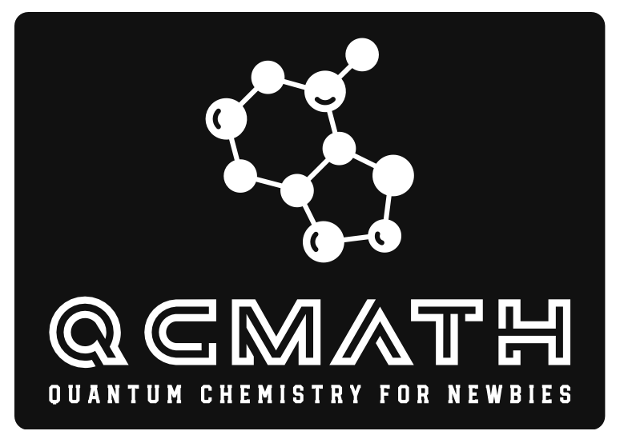

# qcmath



Mathematica modules for electronic structure calculations developed at the 
Laboratoire de Chimie et Physique Quantiques ([LCPQ](https://www.lcpq.ups-tlse.fr)) UMR5626 (Toulouse, France).
The purpose of this software is to take advantage of the powerful symbolic nature of [Mathematica](https://www.wolfram.com/mathematica/) to help newcomers in quantum chemistry easily develop their ideas.
Note that qcmath is **not** designed for computational efficiency.

**Contributors:**
- [Pierre-Francois Loos](https://pfloos.github.io/WEB_LOOS)
- [Anthony Scemama](https://scemama.github.io)
- Enzo Monino
- [Antoine Marie](https://antoine-marie.github.io)
- Raul Quintero

# What is it?

Quantum chemistry methods are highly compatible with computer utilization, owing to the matrix formulation of quantum mechanics, which leverages the power of linear algebra packages like [BLAS](https://www.netlib.org/blas/) and [LAPACK](https://www.netlib.org/lapack/). As a result, a wide array of quantum chemistry software is currently available, encompassing both free and commercial options. These software packages cater to specific methods or offer a diverse range of methodologies, utilizing various types of basis functions, among other features. A considerable number of quantum chemistry codes exist, covering a comprehensive range of methods. For a comprehensive list of these codes, refer to Wikipedia's page on quantum chemistry and solid-state physics software (<https://en.wikipedia.org/wiki/List_of_quantum_chemistry_and_solid-state_physics_software>).

Regrettably, despite the efficient design of many of these software packages, they can be challenging to comprehend as they often employ low-level programming languages. Moreover, these programs are not primarily intended for educational purposes or for facilitating understanding. This is precisely where qcmath comes into play. qcmath aims to assist newcomers in the field of quantum chemistry by providing a user-friendly platform for developing ideas and codes. It is worth noting that certain software packages utilize higher-level programming languages, which can enhance code comprehension. As for qcmath, it is a compilation of Mathematica modules specifically designed for conducting electronic structure calculations.

Before delving into the specifics of qcmath, let us provide an overview of the Mathematica environment. Mathematica is a comprehensive software system developed by Wolfram Research, initially conceptualized by Stephen Wolfram. It boasts a wide range of built-in libraries that can be utilized for diverse purposes. One of its key strengths lies in its ability to perform computer algebra operations, such as derivatives, integrals, and expression simplifications. Furthermore, Mathematica enables the numerical evaluation of these expressions. Another notable feature is its advanced plotting capabilities, supporting intricate visualizations of functions in one, two, and three dimensions. Numerous books offer extensive examples of Mathematica's applications across various domains. With its versatility, Mathematica has become a powerful tool employed in numerous scientific fields, including education, research, and industry.

Mathematica comprises two main components: the kernel and the front end. The kernel interprets expressions and generates result expressions, which can then be displayed using the front end. The original front end takes the form of a notebook interface, facilitating the creation and editing of notebook documents that can contain code, plaintext, images, and graphics. qcmath, specifically, relies on these notebook documents. It is important to note that qcmath is not primarily designed for computational efficiency but rather focuses on providing a user-friendly environment.

# Installation guide
The qcmath software can be downloaded on GitHub as a Git repository
```
git clone https://github.com/LCPQ/qcmath.git
```

Then, one must define the variable `QCMATH_ROOT` and install [PySCF](https://pyscf.org) using `pip`
```
pip install pyscf
```

PySCF is used for the computation of one- and two-electron integrals. Here is the list of the requirements to use qcmath:
- Linux OS
- Wolfram Mathematica $\geq$ 12.1
- PySCF
- Python $\geq$ 3.6.0 
- Numpy $\geq$ 1.13

Note that the version of Python and Numpy is fixed by PySCF.

# Quick start
Before running any qcmath calculation, one needs to define the working directory as 
```ruby
SetDirectory[NotebookDirectory[]];
path=Directory[];
py="your_path_to_python"
NotebookEvaluate[path<>"/src/Main/Main.nb"]
```

To streamline the execution of other notebooks and prevent the need for directory changes, the first line of code sets the working directory as the directory containing the notebook. This ensures a seamless evaluation process. Following that, the second line establishes the variable `path` as the current directory, which corresponds to the working directory. The third line designates the path to your Python installation, allowing for appropriate configuration. Lastly, the main notebook is evaluated, with the inclusion of the `path` variable to locate the correct directory. This approach ensures smooth execution and seamless integration of the required files.

Once this first step is done, one can run a qcmath calculation as follows
```ruby
qcmath[molecule_name,basis_set,methods]
```
To invoke the qcmath module, use the keyword "qcmath" followed by three arguments. These arguments are either strings or a list of strings. The first argument is the name of the molecule to be studied, represented as a string. For example, in the case of the $\text{H}_2$ molecule, it would be specified as "H2". The second argument corresponds to the basis set and is also provided as a string. For instance, in the example of the 6-31G basis set, it would be specified as "6-31G". In summary, taking the example of the $\text{H}_2$ molecule in the 6-31G basis set using the restricted Hartree-Fock method, the qcmath module call would resemble the following code:
```ruby
qcmath["H2","6-31g",{"RHF"}]
```

The molecular geometry is provided through a .xyz file located in the `mol` directory, while the basis set file is stored in the `basis` directory. Additional options can be specified, such as the charge and spin multiplicity of the molecule. If these options are not explicitly stated, the default values are zero for the charge (neutral) and singlet state for the spin multiplicity.
Furthermore, options related to different methods can also be specified, but we will discuss them in the upcoming section. It is worth noting that most of the presented methods offer both spin and spatial orbital implementations. You can choose between them using the keyword `"spinorbital"`, with the default value being `False` (indicating `spatialorbital` as the default choice).
For a comprehensive list of all available options, including charge, spin multiplicity, and method-related choices, please refer to the `main/default_options.nb` notebook. This notebook presents the options in the form of a dictionary, providing a convenient reference for configuring and customizing the calculations.

# User Guide

The qcmath software is currently undergoing active development, and while many of the features discussed below are not yet available, they represent the initial roadmap for the software's future. This User Guide provides a comprehensive introduction to the underlying theoretical concepts and showcases the functionalities offered by these methods. It serves as a valuable resource to gain insights into the theoretical background and explore the capabilities that will be incorporated into qcmath as it continues to evolve.

## Ground-state calculations

### Hartree-Fock
In the context of the Hartree-Fock (HF) approximation, the electronic wave function is expressed as a Slater determinant comprising $N$ molecular orbitals (MOs). Within the restricted HF (RHF) formalism, the Roothaan-Hall equations come into play, given by $\mathbf{F} \mathbf{C} = \mathbf{S} \mathbf{C} \mathbf{\epsilon}$. Here, $\mathbf{F}$ represents the Fock matrix, $\mathbf{C}$ denotes the matrix of MO coefficients, $\mathbf{S}$ stands for the matrix representing atomic orbital overlaps, and $\mathbf{\epsilon}$ is a diagonal matrix containing the orbital energies.

Since the Fock matrix relies on the MO coefficients $\mathbf{C}$, which are obtained from the Fock matrix itself, these equations necessitate a self-consistent solution. To facilitate this process, various options can be specified to customize the calculations and achieve desired outcomes:
- an initial guess of the Fock matrix needs to be diagonalized to give the MO coefficients and this initial guess is described by the keyword `"guess_type"`
  - `"guess_type"="core"` (default) corresponds to the core Hamiltonian defined as $\mathbf{H_c} = \mathbf{T} + \mathbf{V}$ where $\mathbf{T}$ is the kinetic energy matrix and $\mathbf{V}$ is the external potential.
  - `"guess_type"`$\rightarrow$`="huckel"` corresponds to the Hückel Hamiltonian 
  - `"guess_type"="random"`  corresponds to random MO coefficients
  
- converging HF calculation
  - `"maxSCF"`: maximum number of iterations, by default `"maxSCF"=100`
  - `"threshHF"`: convergence threshold on the commutator $\mathbf{F} \mathbf{P} \mathbf{S} - \mathbf{S} \mathbf{P} \mathbf{F}$, by default `"threshHF"=10^-7`
  - `"DIIS"`: rely on the Direct Inversion in the Iterative Subspace (DIIS) where the Fock matrix is extrapolated at each iteration using the ones of the previous iterations, by default `"DIIS"=True`
  - `"n_DIIS"`: size of the DIIS space, by default `"n_DIIS"=5`
  - `"level_shift"`: a level shift increases the gap between the occupied and virtual orbitals, it can help to converge the SCF process for systems with a small HOMO-LUMO gap, by default `"level_shift"=0.0`eV

- orthogonalization matrix with the keyword `"ortho_type"`
  - `"ortho_type"="lowdin"` (default): Löwdin orthogonalization 
  - `"ortho_type"="canonical"`: Canonical orthogonalization 

- print supplementary information about the calculation with the keyword `"verbose"`
  - `"verbose" = False` by default, if `"verbose" = True` then more information about the CPU timing and additional quantities are printed. Note that this option is available for most methods in qcmath.

Two flavors of Hartree-Fock (HF) are available in qcmath: restricted HF (RHF) and unrestricted HF (UHF). To run a UHF calculation, one simply does

```ruby
qcmath["H2","6-31g",{"UHF"}]
```

### Møller-Plesset (MP) perturbation theory
The MP2 correlation energy is defined by 
```math
E_c^{\text{MP2}} = \frac{1}{4} \sum_{ij}^{\text{occ}} \sum_{ab}^{\text{vir}} \frac{ |\bra{ij}\ket{ab}|^2 }{\epsilon^{\text{HF}}_i + \epsilon^{\text{HF}}_j - \epsilon^{\text{HF}}_a - \epsilon^{\text{HF}}_b}
```

Since MP2 needs a HF reference, a first HF calculation must be done. This is automatically taken into account by qcmath and a MP2 calculation can be done using 
```ruby
qcmath["H2","6-31g",{"RHF","MP2"}]

```
or 
```ruby
qcmath["H2","6-31g",{"MP2"}]
```
Note that in the last case, a RHF is performed by default so if we want to have a UHF reference we will run
```ruby
qcmath["H2","6-31g",{"UHF","MP2"}]
```

## Charged excitations

Methods based on the one-body Green's function (1-GF) offer a means to describe charged excitations, namely, the ionization potential (IP) and electron affinity (EA) of a system. This particular aspect forms the heart of qcmath, with a diverse range of methods, approximations, and options available. To ensure clarity and coherence, this section is organized as follows:
Firstly, we provide a brief introduction to the general equations that depend on the degree of (partial) self-consistency. These general equations are shared among the three self-energy approximations implemented in qcmath: the second-order Green's function (GF2), the $GW$ approximation, and the $T$-matrix approximation. By outlining these common equations, we establish a foundational understanding of the framework.
Subsequently, we present the specific expressions corresponding to each of the self-energy approximations. This breakdown allows for a comprehensive exploration of the distinct methodologies incorporated in qcmath, enabling users to leverage the most suitable approach for their research goals.

Three levels of (partial) self-consistency are available in qcmath:
- the one-shot scheme where quasiparticles and satellites are obtained by solving, for each orbital $p$, the frequency-dependent quasiparticle equation 
```math
\omega = \epsilon^{\text{HF}}_p + \Sigma_{pp}^c(\omega)
```
where a diagonal approximation of the self-energy is used. Because we are, most of the time, interested in the quasiparticle solution one can use the linearized quasiparticle equation
```math
\epsilon^{\text{QP}}_p = \epsilon^{\text{HF}}_p + Z_p \Sigma_{pp}^c(\epsilon^{\text{HF}}_p)
```
where the renormalization factor $Z_p$ is defined as 
```math
Z_p=\left[ 1-\frac{\partial \Sigma_{pp}(\omega)}{\partial \omega}\Bigr\rvert_{\omega =\epsilon^{\text{HF}}_p } \right]^{-1}
```
- the eigenvalue scheme where one iterates the quasiparticle energies that are used to build the self-energy $\Sigma_{pp}^c$ (and $Z_p$)
- the quasiparticle self-consistent scheme where an effective Fock matrix built from a frequency-independent Hermitian self-energy as [^1]
```math
\tilde{F}_{pq}= F_{pq} + \tilde{\Sigma}_{pq}
```
where 
```math
\tilde{\Sigma}_{pq}=\frac{1}{2}\left[\Sigma_{pq}^c(\epsilon^{\text{HF}}_p) + \Sigma_{qp}^c(\epsilon^{\text{HF}}_p)\right]
```
Note that the whole self-energy is computed for this last scheme (not only the diagonal).

The non-linear quasiparticle equation can be exactly transformed in a linear eigenvalue problem using an upfolding process.[^2],[^3],[^4] For each orbital $p$, this yields a linear eigenvalue problem of the form
```math
\mathbf{H}_{p} \cdot \mathbf{c}_{\nu} = \epsilon_{\nu}^{\text{QP}} \mathbf{c}_{\nu}
```
where $\nu$ runs over all solutions, quasiparticle and satellites and with [^5]
```math
	\mathbf{H}_{p} = 
	\begin{pmatrix}
		\epsilon_{p}^{\text{HF}}		&	\mathbf{V}_{p}^{\text{2h1p}}	&	\mathbf{V}_{p}^{\text{2p1h}}
		\\
		(\mathbf{V}_{p}^{\text{2h1p}})^T	&	\mathbf{C}^{\text{2h1p}}			&	\mathbf{0}
		\\
		(\mathbf{V}_{p}^{\text{2p1h}})^T	&	\mathbf{0}				&	\mathbf{C}^{\text{2p1h}}	
	\end{pmatrix}
```
Note that the different blocks will depend on the approximated self-energy. 

Now that the general equations have been set, we can turn our attention to the various approximations of the self-energy. Three different approximations are available in qcmath: the second-order Green's function (GF2), the $GW$ approximation, and the $T$-matrix approximation. For each approximation the three partially self-consistent schemes and the upfolding process are available. Note also that, the regularization parameters are also available in qcmath.
 
### Second-order Green's function (GF2) approximation
The GF2 correlation self-energy is closely related to MP2 and is given by the following expression
```math
	\Sigma_{pq}^{\text{GF2}}(\omega) = \frac{1}{2}\sum_{ija} \frac{\bra{pa}\ket{ij} \bra{qa}\ket{ij}}{\omega + \epsilon_{a}^{\text{HF}} - \epsilon_{i}^{\text{HF}} - \epsilon_{j}^{\text{HF}}}  + \frac{1}{2}\sum_{iab} \frac{\bra{pi}\ket{ab} \bra{qi}\ket{ab}}{\omega + \epsilon_{i}^{\text{HF}} - \epsilon_{a}^{\text{HF}} - \epsilon_{b}^{\text{HF}}}
```
Keywords need to be specified for the different schemes:
- `"GOF2"`: run a one-shot calculation
- `"evGF2"`: run an eigenvalue calculation 
- `"qsGF2"`: run a quasiparticle calculation 
- `"upfGF2"`: run an upfolded calculation

Example of a one-shot calculation
```ruby
qcmath["H2","6-31g",{"G0F2"}]
```
Note that here, a RHF calculation is done by default.

### $GW$ approximation
The $GW$ correlation self-enegy is given by
```math
	\Sigma_{pq}^{GW}(\omega) 
	= \sum_{im} \frac{M_{pi,m}^{\text{ph}}M_{qi,m}^{\text{ph}}}{\omega - \epsilon_{i}^{\text{HF}} + \Omega_{m}^{\text{ph}}}
	+ \sum_{am} \frac{M_{pa,m}^{\text{ph}}M_{qa,m}^{\text{ph}}}{\omega - \epsilon_{a}^{\text{HF}} - \Omega_{m}^{\text{ph}}}
```
where the screened two-electron integrals are given by 
```math
	M_{pq,m}^{\text{ph}} = \sum_{ia} \braket{pi|qa} \left(\mathbf{X}^{\text{ph}} + \mathbf{Y}^{\text{ph}} \right)_{ia,m}
```
with $\mathbf{X}^{\text{ph}}$ and $\mathbf{Y}^{\text{ph}}$ are the eigenvectors and excitations energies $\Omega_{m}^{\text{ph}}$ are the eigenvalues of the ph-dRPA problem.
Keywords for the method argument need to be specified for the different schemes: 
- `"GOWO"`: run a one-shot calculation
- `"evGW"`: run an eigenvalue calculation 
- `"qsGW"`: run a quasiparticle calculation 
- `"upfGW"`: run an upfolded calculation

Example of an eigenvalue calculation
```ruby
qcmath["H2","6-31g",{"evGW"}]
```
Note that here, a RHF calculation is done by default.

### T-matrix approximation
The T-matrix correlation self-energy is given by
```math
	\Sigma_{pq}^{GT}(\omega) 
	= \sum_{in} \frac{M_{pi,n}^{\text{pp}}M_{qi,n}^{\text{pp}}}{\omega + \epsilon_{i}^{\text{HF}} - \Omega_{n}^{\text{pp}}}
	+ \sum_{an} \frac{M_{pa,n}^{\text{hh}}M_{qa,n}^{\text{hh}}}{\omega + \epsilon_{a}^{\text{HF}} - \Omega_{n}^{\text{hh}}}
```
where the pp and hh versions of the screened two-electron integrals read
```math
\begin{align}
	M_{pq,n}^{\text{pp}} & = \sum_{c < d} \bra{pq}\ket{cd} X_{cd,n}^{\text{pp}} + \sum_{k < l} \bra{pq}\ket{kl} Y_{kl,n}^{\text{pp}}
	\\
	M_{pq,n}^{\text{hh}} & = \sum_{c < d} \bra{pq}\ket{cd} X_{cd,n}^{\text{hh}} + \sum_{k < l} \bra{pq}\ket{kl} Y_{kl,n}^{\text{hh}} 
\end{align}
```
The components $X_{cd,n}^{\text{pp/hh}}$ and $Y_{kl,n}^{\text{pp/hh}}$ and excitation energies $\Omega_{n}^{\text{pp/hh}}$ are the double addition/removal eigenvector components and eigenvalues, respectively, of the pp-RPA eigenvalue problem.
Keywords for the method argument need to be specified for the different schemes:
- `"GOTO"`: run a one-shot calculation
- `"evGT"`: run an eigenvalue calculation 
- `"qsGT"`: run a quasiparticle calculation 
- `"upfGT"`: run an upfolded calculation

Example of a quasiparticle calculation
```ruby
qcmath["H2","6-31g",{"qsGT"}]
```
Note that here, a RHF calculation is done by default.

## Neutral excitations

Within qcmath, the computation of excitation energies utilizes methods formulated as a Casida-like equation.[^6] This equation is an eigenvalue equation that serves as a fundamental component in linear response theory. It plays a pivotal role in various approaches, including time-dependent density functional theory (TD-DFT), the random phase approximation (RPA), and the Bethe-Salpeter equation (BSE).
In this section, we begin by exploring the RPA method and distinguishing between different variations within this framework. By examining these different flavors of the RPA method, we gain insights into their unique characteristics and applicability.
Subsequently, we delve into the discussion of the BSE method. This method represents another important approach for computing excitation energies, with its distinct theoretical foundations and computational considerations. By exploring the BSE method, users can gain a comprehensive understanding of its principles and its role within qcmath.

### Particle-hole random-phase approximation (ph-RPA)

The traditional RPA can be found under different names like RPAx or ph-RPA. We choose to call it ph-RPA to make the difference with the particle-particle RPA (pp-RPA). The ph-RPA problem takes the form of the following Casida-like equation 
```math
	\begin{pmatrix}
		\mathbf{A}^{\text{ph}} & \mathbf{B}^{\text{ph}} 
		\\
		- \mathbf{B}^{\text{ph}} &  -\mathbf{A}^{\text{ph}}
	\end{pmatrix}
	\cdot
	\begin{pmatrix}
		\mathbf{X}^{\text{ph}} & \mathbf{Y}^{\text{ph}}
		\\
		\mathbf{Y}^{\text{ph}} & \mathbf{X}^{\text{ph}}
	\end{pmatrix}
	=
	\begin{pmatrix}
		\mathbf{X}^{\text{ph}} & \mathbf{Y}^{\text{ph}}
		\\
		\mathbf{Y}^{\text{ph}} & \mathbf{X}^{\text{ph}}
	\end{pmatrix}
	\cdot
	\begin{pmatrix}
		\mathbf{\Omega}^{\text{ph}} & \mathbf{0}
		\\
		\mathbf{0} & -\mathbf{\Omega}^{\text{ph}}
	\end{pmatrix}
```
where $\Omega_m$ is the diagonal matrix of the excitation energies, $\mathbf{X}^{\text{ph}}$ and $\mathbf{Y}^{\text{ph}}$ matrices are the transition coefficients, and the matrix elements are defined as 
```math
\begin{align}
	A_{ia,jb}^{\text{ph}} & = (\epsilon_{a}^{\text{HF}} - \epsilon_{i}^{\text{HF}}) \delta_{ij} \delta_{ab} + \bra{ib}\ket{aj} 
	\\
	B_{ia,jb}^{\text{ph}} & = \bra{ij}\ket{ab} 
\end{align}
```
Now, from these equations, different approximations arise:
- if we only take the direct term for the antisymmetrized two-electron integrals we end up with the direct ph-RPA (ph-dRPA), this is the one used in the $GW$ approximation
- if we use the Tamm–Dancoff approximation (TDA) that sets $\mathbf{B}^{\text{ph}}=\mathbf{0}$, we end up with the ph-TDA approach

Note that TDA can be used with the ph-dRPA flavor and gives ph-dTDA. Ground-state correlation energy can be computed with 
```math
E_c^{\text{ph-RPA}}=\frac{1}{2} \left(\sum_m \Omega_m^{\text{ph}} - \text{Tr}(\mathbf{A})\right) 
```
Keywords for the method argument need to be specified for the different approaches and options:
- `"RPAx"`: run a ph-RPA calculation
- `"RPA"`: run a ph-dRPA calculation

The option `"TDA"` can be set to `True`, by default `"TDA"=False`.

### Particle-particle random-phase approximation (pp-RPA)

The particle-particle RPA (pp-RPA) problem considers the excitation energies of the ($N+2$)- and ($N-2$)-electron system (with $N$ the number of electrons). It is also defined by a slightly different eigenvalue problem than ph-RPA:
```math
\begin{pmatrix}\mathbf{C}^{\text{pp}} & \mathbf{B}^{\text{pp/hh}} \\ -\left(\mathbf{B}^{\text{pp/hh}}\right)^{\dagger} & -\mathbf{D}^{\text{hh}} \end{pmatrix} \cdot\begin{pmatrix} \mathbf{X}^{\text{pp}} & \mathbf{Y}^{\text{hh}} \\ \mathbf{Y}^{\text{pp}} & \mathbf{X}^{\text{hh}}\end{pmatrix} \\ = \begin{pmatrix} \mathbf{\Omega}^{\text{pp}} & \mathbf{O} \\ \mathbf{O} & \mathbf{\Omega}^{\text{hh}} \end{pmatrix} \cdot \begin{pmatrix} \mathbf{X}^{\text{pp}} & \mathbf{Y}^{\text{hh}} \\ \mathbf{Y}^{\text{pp}} & \mathbf{X}^{\text{hh}} \end{pmatrix}
```
where $\mathbf{\Omega}^{\text{pp/hh}}$ are the diagonal matrices of the double addition/removal excitation energies, labeled by $n$, and the matrix elements are defined as 
```math
\begin{align}
	C_{ab,cd}^{\text{pp}} 
	& = (\epsilon_{a}^{\text{HF}} + \epsilon_{b}^{\text{HF}}) \delta_{ac} \delta_{bd} + \bra{ab}\ket{cd}
	\\
	B_{ab,ij}^{\text{pp/hh}} 
	& = \bra{ab}\ket{ij}
	\\
	D_{ij,kl}^{\text{hh}} 
	& = -(\epsilon_{i}^{\text{HF}} + \epsilon_{j}^{\text{HF}}) \delta_{ik} \delta_{jl} + \bra{ij}\ket{kl}
\end{align}
```
The $\mathbf{X}^{\text{pp/hh}}$ and $\mathbf{Y}^{\text{pp/hh}}$ are the double addition/removal transition coefficients matrices. We can obtain the correlation energy at the pp-RPA level using [^7]
$$E_c^{\text{pp-RPA}} =  \frac{1}{2} \left(\sum_n \Omega_n^{\text{pp}}  - \sum_n \Omega_n^{\text{hh}}  - \text{Tr}\mathbf{C}^{\text{pp}} - \text{Tr}\mathbf{D}^{\text{hh}}\right)$$
The keyword to use pp-RPA is `"pp-RPA"`. Note that TDA is also available with the option `"TDA"=True`.

### Bethe-Salpeter equation (BSE)
The Bethe-Salpeter equation (BSE) is related to the two-body Green's function (2-GF). The central quantity is the so-called BSE kernel defined as the functional derivative of the self-energy with respect to the 1-GF. There are several approximations of the self-energy and each one of them leads to a different BSE approximation. The common central equation is the following eigenvalue equation

```math
\begin{pmatrix}\mathbf{A}^{\text{BSE}} & \mathbf{B}^{\text{BSE}} \\ -\mathbf{B}^{\text{BSE}} & -\mathbf{A}^{\text{BSE}} \end{pmatrix}\cdot\begin{pmatrix}\mathbf{X}_m^{\text{BSE}}\\ \mathbf{Y}_m^{\text{BSE}}\end{pmatrix}=\mathbf{\Omega}_m^{\text{BSE}}\begin{pmatrix}\mathbf{X}_m^{\text{BSE}}\\ \mathbf{Y}_m^{\text{BSE}}\end{pmatrix}
```
    
where the BSE matrix elements depend on the choice of the BSE kernel. To run a BSE calculation we have first to specify the approximation for the self-energy with the method argument and the keyword for this option is `"BSE"=True`. Note that in general a BSE calculation is done in the static approximation, which is the equivalent of the adiabatic approximation in TD-DFT. It is possible to take into account dynamical effects using first-order perturbation theory [^8] using the option `"dBSE"=True`. This dynamical correction is applicable for all the different BSE kernels available in qcmath. Note that this dynamical correction is only available in TDA with the option `"dTDA"`.

# Programmer Guide

As mentioned in the first section, one of the primary objectives of qcmath is to enable newcomers in quantum chemistry to explore and advance their ideas through coding. Therefore, it is crucial to provide them with the ability to incorporate their methods into qcmath. To facilitate this process, we have developed a notebook example called `module_example.nb` to guide users step-by-step. The following outlines the different stages involved in adding a new method to qcmath:

- The new method needs to be implemented in its notebook
- Add your method in the `utils/list_method.nb` and specify the dependencies (ex: if post-HF method then dependency=`"RHF"`)
- Add default options in `main/default_options.nb` if needed
- Add a call to your method in `Main.nb` as
```ruby
NameNewMethod="NameNewMethod"
If[ToDoModules[NameNewMethod]["Do"] == True,
  NotebookEvaluate[path<>"/src/"<>NameNewMethod<>".nb"];

PrintTemporary[Style[NameNewMethod<>" calculation...", Bold, Orange]];
{time, outputsNewMethod} = Timing[NewMethod[arguments, options]];	

If[verbose == True, 
  Print["CPU time for "<>NameNewMethod<>" calculation= ", time]];
];
```
For each new method notebook, it is essential to organize the code into potentially three modules. The first module is responsible for reading the input and options, followed by invoking either the spin or spatial orbitals module, and ultimately returning the corresponding output. The remaining two modules are dedicated to implementing the new method in spin and spatial orbitals, respectively. It is important to note that if your method is exclusively implemented in spatial orbitals, your notebook will consist of only two parts. Further details regarding this structure can be found in the `module_example.nb` notebook.

[^1]: [E. Monino and P. F. Loos, J. Chem. Theory Comput. (Open Access) 17, 2852 (2021).](https://doi.org/10.1021/acs.jctc.1c00074)
[^2]: [O. J. Backhouse, M. Nusspickel, and G. H. Booth, J. Chem. Theory Comput. 16, 1090−1104 (2020).](https://doi.org/10.1021/acs.jctc.9b01182)
[^3]: [S. J. Bintrim, and T. C. Berkelbach, J. Chem. Phys. 154, 041101 (2021).](https://doi.org/10.1063/5.0035141)
[^4]: [E. Monino and P. F. Loos, J. Chem. Phys. (Open Access) 156, 231101 (2022).](https://doi.org/10.1063/5.0089317)
[^5]: [J. Tölle and G. Kin-Lic Chan, J. Chem. Phys. 158, 124123 (2023).](https://doi.org/10.1063/5.0139716)
[^6]: [M. E. Casida, J. Chem. Phys. 122, 054111 (2005).](https://doi.org/10.1063/1.1836757)
[^7]: [D. Peng, S. N. Steinmann, H. van Aggelen, J. Chem. Phys. 139, 104112 (2013).](https://doi.org/10.1063/1.4820556)
[^8]: [P.-F. Loos and X. Blase, J. Chem. Phys. 153, 114120 (2020).](https://doi.org/10.1063/5.0023168)
